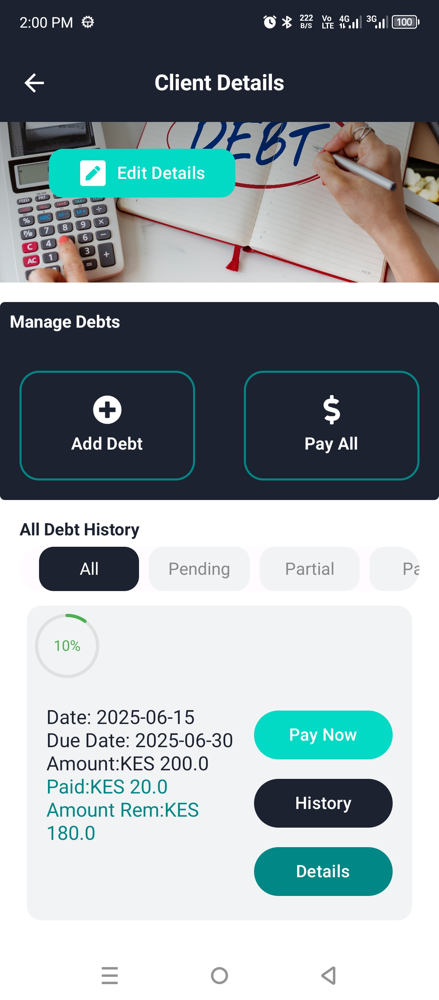
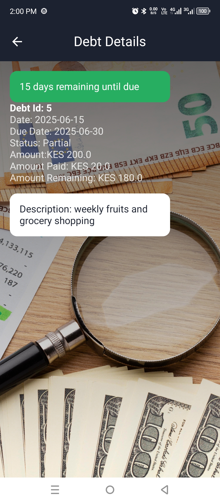
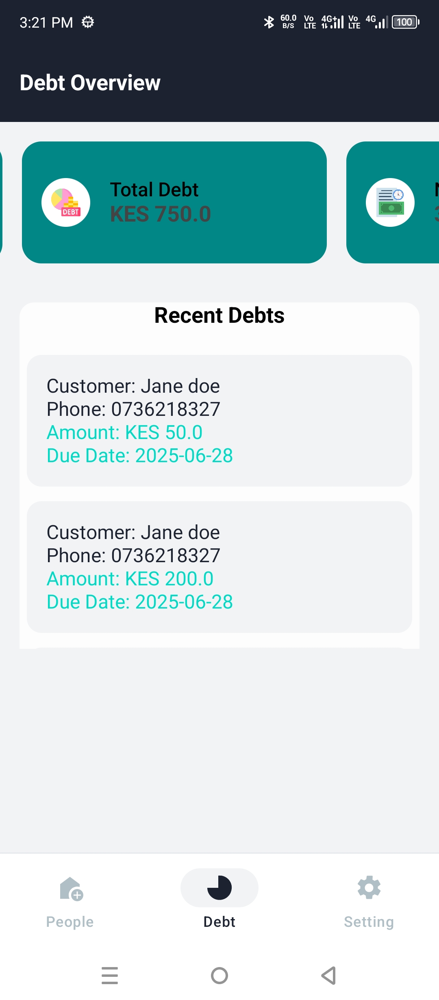

# How to Clone This Repository

To clone this repository, follow these steps:

1. Open your terminal or command prompt.
2. Run the following command:

   ```sh
   git clone https://github.com/Dismas-Ospaltic/Debt-Management-Mobile.git


## About this app

This is an android-based app to Debt.
User can use the app to power their business by recording the debt in the app.
this is so convenient because user collects info of the customers the give goods on credit

## App's  screenshots
 




## Contributing

pull requests are welcome. for major Changes, please open an issue first to
discuss what you would like to change.

Please make sure to update tests as appropriate